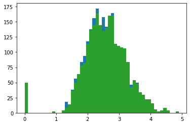

# fLing : Fast Linguistics 


> The fLing Open Source Project, in collaboration with Tezpur University Dept. of CSE - a library for all your unsupervised linguistics tasks in production.


### Introduction
This is a library for performing unsupervised lingustic functionalities based on textual fields on your data. An API will also be released for real-time inference. This is a beta version of the of fling open source project. For download information and usage manuals, take a look at the notebook files in examples.

Primary functionalities
- [x] Pre-process text columns in dataset, with custom tokenizers.
- [x] Add tf-idf dictionary as a new column to a dataset.
- [x] Add pretrained word embeddings to convert raw text to document embeddings (word2vec, glove, fastText, custom trained). This module has dependency on gensim and tensorflow.
- [x] Train fastText, word2vec, doc2vec word vectors and add a new column to dataset.
- [x] Use tfidf2vec dict to convert tfidf information with pretrained word embeddings to get corpus enhanced combined word embeddings.
- [x] Save cluster characteristics in a trained model and used distance based methods to compute fast clusters for documents in test data.
- [x] Use clusterID's as a new feature for other supervised and unsupervised tasks

Upcoming additions
- Adding Sequential Denoising Autoencoders
- ClusterGANS initial edition
 
*fastboardAI/fling*
https://github.com/fastboardAI/fling.git

Latest Developments tracked in
*arnab64/fling*
https://github.com/arnab64/fling.git

### Example notebook: ADDING PRETRAINED VECTORS, TRAINING VECTORS, CREATING COMBINED VECTORS
```python
# EXAMPLE: classifying SPAM with fLing

import matplotlib as mpl
from imp import reload
from nltk.corpus import stopwords
from collections import Counter
import pandas as pd
import numpy as np
import scipy
import matplotlib as mpl
import matplotlib.pyplot as plt
import nltk,re,pprint
import sys,glob,os
import operator, string, argparse, math, random, statistics
import matplotlib.pyplot as plt
from sklearn import metrics
```


```python
from fling import utilities as ut
from fling import tfidfModule as tfm

#load and preProcess (tokenize) the data, you can use other tokenizers as well
os.chdir("/Users/arnabborah/Documents/repositories/fling/")
spamtm = tfm.dataProcessor("datasets/spamTextMessages.csv",None)
spamtm.dataInitial
```


<div>
<style scoped>
    .dataframe tbody tr th:only-of-type {
        vertical-align: middle;
    }

    .dataframe tbody tr th {
        vertical-align: top;
    }

    .dataframe thead th {
        text-align: right;
    }
</style>
<table border="1" class="dataframe">
  <thead>
    <tr style="text-align: right;">
      <th></th>
      <th>Category</th>
      <th>Message</th>
    </tr>
  </thead>
  <tbody>
    <tr>
      <th>0</th>
      <td>ham</td>
      <td>Go until jurong point, crazy.. Available only ...</td>
    </tr>
    <tr>
      <th>1</th>
      <td>ham</td>
      <td>Ok lar... Joking wif u oni...</td>
    </tr>
    <tr>
      <th>2</th>
      <td>spam</td>
      <td>Free entry in 2 a wkly comp to win FA Cup fina...</td>
    </tr>
    <tr>
      <th>3</th>
      <td>ham</td>
      <td>U dun say so early hor... U c already then say...</td>
    </tr>
    <tr>
      <th>4</th>
      <td>ham</td>
      <td>Nah I don't think he goes to usf, he lives aro...</td>
    </tr>
    <tr>
      <th>...</th>
      <td>...</td>
      <td>...</td>
    </tr>
    <tr>
      <th>5567</th>
      <td>spam</td>
      <td>This is the 2nd time we have tried 2 contact u...</td>
    </tr>
    <tr>
      <th>5568</th>
      <td>ham</td>
      <td>Will ü b going to esplanade fr home?</td>
    </tr>
    <tr>
      <th>5569</th>
      <td>ham</td>
      <td>Pity, * was in mood for that. So...any other s...</td>
    </tr>
    <tr>
      <th>5570</th>
      <td>ham</td>
      <td>The guy did some bitching but I acted like i'd...</td>
    </tr>
    <tr>
      <th>5571</th>
      <td>ham</td>
      <td>Rofl. Its true to its name</td>
    </tr>
  </tbody>
</table>
<p>5572 rows × 2 columns</p>
</div>


```python
# creating a flingTFIDF to compute TF-IDF and add it as a new column (pd.dataframe) to data
ftf = tfm.flingTFIDF(spamtm.dataInitial,'Message')
ftf.smartTokenizeColumn()
ftf.getTF()
ftf.computeIDFmatrix()
ftf.getTFIDF()

#do the next line only if you are computing distances on tfIDF dict only
ftf.createDistanceMetadata()
```

    [ ================================================== ] 100.00%
    Adding term frequency column based on stopsRemoved
    [ ================================================== ] 100.00%
    Computing list of words for IDF...
    
    Created list of terms for IDF matrix with 8780  terms.
    
    Computing global IDF matrix...
    
    [ ================================================== ] 100.00%
    Computing and adding TF-IDF column based on stopsRemoved
    [ ================================================== ] 100.00%


```python
import gensim
from fling import vectorize as vect

# training and adding doc2vec vectors based on column 'Messages'.
# gensim is a requirement to train doc2vec vectors 
vecc = vect.vectorize(ftf.data,'Message')
trained_doc2vec_model = vecc.trainDocVectors()
vecc.addDocVectors()
vecc.data
```

    5572 documents added!


<div>
<style scoped>
    .dataframe tbody tr th:only-of-type {
        vertical-align: middle;
    }

    .dataframe tbody tr th {
        vertical-align: top;
    }

    .dataframe thead th {
        text-align: right;
    }
</style>
<table border="1" class="dataframe">
  <thead>
    <tr style="text-align: right;">
      <th></th>
      <th>Category</th>
      <th>Message</th>
      <th>stopsRemoved</th>
      <th>tfMatrix</th>
      <th>sumTFIDF</th>
      <th>doc2vec</th>
    </tr>
  </thead>
  <tbody>
    <tr>
      <th>0</th>
      <td>ham</td>
      <td>Go until jurong point, crazy.. Available only ...</td>
      <td>go jurong point crazy available bugis n great ...</td>
      <td>word  tf    tf-idf
0          go   1 ...</td>
      <td>38.281443</td>
      <td>[0.015742207, 0.0031893118, 0.010138756, -0.08...</td>
    </tr>
    <tr>
      <th>1</th>
      <td>ham</td>
      <td>Ok lar... Joking wif u oni...</td>
      <td>ok lar joking wif u oni</td>
      <td>word  tf    tf-idf
0      ok   1  1.31950...</td>
      <td>12.583182</td>
      <td>[-0.014953367, 0.030154036, 0.017708715, -0.10...</td>
    </tr>
    <tr>
      <th>2</th>
      <td>spam</td>
      <td>Free entry in 2 a wkly comp to win FA Cup fina...</td>
      <td>free entry  wkly comp win fa cup final tkts st...</td>
      <td>word  tf    tf-idf
0         entry ...</td>
      <td>49.524838</td>
      <td>[0.008385706, 0.004221165, -2.3364251e-05, -0....</td>
    </tr>
    <tr>
      <th>3</th>
      <td>ham</td>
      <td>U dun say so early hor... U c already then say...</td>
      <td>u dun say early hor u c already say</td>
      <td>word  tf    tf-idf
0        u   2  1.669...</td>
      <td>16.431526</td>
      <td>[0.029679298, 0.06244122, -0.008049136, -0.119...</td>
    </tr>
    <tr>
      <th>4</th>
      <td>ham</td>
      <td>Nah I don't think he goes to usf, he lives aro...</td>
      <td>nah think goes usf lives around though</td>
      <td>word  tf    tf-idf
0     nah   1  2.70461...</td>
      <td>16.678825</td>
      <td>[0.004876227, -0.008055425, 0.0023417333, 0.00...</td>
    </tr>
    <tr>
      <th>...</th>
      <td>...</td>
      <td>...</td>
      <td>...</td>
      <td>...</td>
      <td>...</td>
      <td>...</td>
    </tr>
    <tr>
      <th>5567</th>
      <td>spam</td>
      <td>This is the 2nd time we have tried 2 contact u...</td>
      <td>nd time tried  contact u u ⣠pound prize  cla...</td>
      <td>word  tf    tf-idf
0            ...</td>
      <td>29.685673</td>
      <td>[0.043106798, 0.06623637, -0.010588597, -0.185...</td>
    </tr>
    <tr>
      <th>5568</th>
      <td>ham</td>
      <td>Will ü b going to esplanade fr home?</td>
      <td>ã¼ b going esplanade fr home</td>
      <td>word  tf    tf-idf
0         ã¼   1  1...</td>
      <td>12.328684</td>
      <td>[0.016016621, -0.01830655, 0.016508967, -0.105...</td>
    </tr>
    <tr>
      <th>5569</th>
      <td>ham</td>
      <td>Pity, * was in mood for that. So...any other s...</td>
      <td>pity * mood soany suggestions</td>
      <td>word  tf    tf-idf
0         pity   ...</td>
      <td>15.080331</td>
      <td>[-0.18763976, 0.03453686, -0.027078941, -0.055...</td>
    </tr>
    <tr>
      <th>5570</th>
      <td>ham</td>
      <td>The guy did some bitching but I acted like i'd...</td>
      <td>guy bitching acted like i'd interested buying ...</td>
      <td>word  tf    tf-idf
0          guy   ...</td>
      <td>32.770129</td>
      <td>[0.009096158, -0.0057535497, 0.004273705, -0.0...</td>
    </tr>
    <tr>
      <th>5571</th>
      <td>ham</td>
      <td>Rofl. Its true to its name</td>
      <td>rofl true name</td>
      <td>word  tf    tf-idf
0  rofl   1  3.143951
1 ...</td>
      <td>7.558242</td>
      <td>[-0.0014662278, 0.009742865, 0.0015902708, -0....</td>
    </tr>
  </tbody>
</table>
<p>5572 rows × 6 columns</p>
</div>


```python
from fling import flingPretrained as fpt

# creating a flingPretrained
# dataProcessed = pd.read_pickle('datasets/data_tfidf_processed.pkl')
fdb = fpt.flingPretrained(vecc.data)
#adding pretrained glove vectors 
fdb.loadPretrainedWordVectors('glove')
fdb.addDocumentGloveVectors()

# adding combo vectors with tfidf and (glove + doc2vec) for inter sentence semantic information addition
fdb.tfidf2vec('tf-idf','glove')
# fdb.tfidf2vec('tf-idf','doc2vec')
fdb.splitTestTrain()
fdb.dataTrain
```

    
    Working on pretrained word embeddings!
    
    Loading Glove Model
    
    400000  words loaded!
    
    GloVe Vectors Loaded!
    
    [ ================================================== ] 100.00%
    Computing column: vec_tfidf-glove
    [ ==                                                 ] 5.81%

    /Users/arnabborah/Documents/repositories/fling/fling/flingPretrained.py:237: RuntimeWarning: Mean of empty slice
      return(np.nanmean(docVecList,axis=0))


    [ =========================================          ] 83.44%%


    

    


```python
# train group characteristics on column 'category' 
fdb.createGroupedCharacteristics('Category')
for key in fdb.groupedCharacteristic.keys():
    print('Characteristic of',key,'\n',fdb.groupedCharacteristic[key])   
```

    
    Computing groupCharacteristics for, Category
    Characteristic of glove 
     None
    Characteristic of vec_tfidf-doc2vec 
     None
    Characteristic of vec_tfidf-glove 
                                                 vec_tfidf-glove
    Category                                                   
    ham       [nan, nan, nan, nan, nan, nan, nan, nan, nan, ...
    spam      [nan, nan, nan, nan, nan, nan, nan, nan, nan, ...
    Characteristic of doc2vec 
                                                         doc2vec
    Category                                                   
    ham       [-0.0008339239, 0.008468696, 0.0014372141, -0....
    spam      [0.00509379, 0.008787291, -0.0049210927, -0.05...
    Characteristic of glove-vector 
                                                    glove-vector
    Category                                                   
    ham       [0.08621057522946847, 0.16108873455431685, 0.1...
    spam      [0.038020029286601906, 0.25794960063990663, 0....
    Characteristic of glove-tfIDF 
                                                     glove-tfIDF
    Category                                                   
    ham       [0.08615151890437718, 0.16173257886936682, 0.1...
    spam      [0.032436123023218626, 0.24874980733559582, 0....


```python
# predict vector based Category for each type of vector added
fdb.addVectorComputedGroup('glove-vector','cGroup_glove')
fdb.addVectorComputedGroup('doc2vec','cGroup_doc2vec')
fdb.addVectorComputedGroup('glove-tfIDF','cGroup_gloveWt_tfidf')
fdb.addVectorComputedGroup('vec_tfidf-glove','cGroup_tfidf-glove')
```

    /Users/arnabborah/Documents/repositories/fling/fling/flingPretrained.py:284: SettingWithCopyWarning: 
    A value is trying to be set on a copy of a slice from a DataFrame.
    Try using .loc[row_indexer,col_indexer] = value instead
    
    See the caveats in the documentation: https://pandas.pydata.org/pandas-docs/stable/user_guide/indexing.html#returning-a-view-versus-a-copy
      self.dataTest[groupName] = computedGroups


```python
#fdb.addVectorComputedGroup('vec_tfidf-doc2vec','cGroup_tfidf-doc2vec')
fdb.getAccuracy('Category','cGroup_glove')
fdb.getAccuracy('Category','cGroup_doc2vec')
fdb.getAccuracy('Category','cGroup_gloveWt_tfidf')
fdb.getAccuracy('Category','cGroup_tfidf-glove')
```

    Accuracy of cGroup_glove 79.84449760765551 %
    Accuracy of cGroup_doc2vec 78.88755980861244 %
    Accuracy of cGroup_gloveWt_tfidf 79.90430622009569 %
    Accuracy of cGroup_tfidf-glove 0.0 %


```python

```


### Example notebook: CLUSTERING
```python
import os
import warnings
warnings.filterwarnings('ignore')
```


```python
from fling import utilities as ut
from fling import tfidfModule as tfm

#change operating folder      
os.chdir("/Users/arnabborah/Documents/repositories/textclusteringDBSCAN/scripts/")
#read the .csv data file using the dataProcessor class
rp = tfm.dataProcessor("../datasets/DataAnalyst.csv")
```

                                      Job Description  Company Name
    Industry                                                       
    -1                                            353           352
    IT Services                                   325           325
    Staffing & Outsourcing                        323           323
    Health Care Services & Hospitals              151           151
    Consulting                                    111           111
    ...                                           ...           ...
    Chemical Manufacturing                          1             1
    Pet & Pet Supplies Stores                       1             1
    Consumer Product Rental                         1             1
    Metals Brokers                                  1             1
    News Outlet                                     1             1
    
    [89 rows x 2 columns]


```python
#create a flingTFIDF object around the pre-processed daa
ftf = tfm.flingTFIDF(rp.dataInitialSmall,'Job Description')

# tokenization, customizable
ftf.smartTokenizeColumn()

# get Term Frequency of each document, and store add it as an object, in a new column
ftf.getTF()

# compute Inverse Document Frequencies across the entire vocabulary
ftf.computeIDFmatrix()

# get TFIDF, and store it as a new column in data, tf-idf
ftf.getTFIDF()

# compute sum of all tf-idf values and add it as a new column
ftf.createDistanceMetadata()
```

    [ ================================================== ] 100.00%
    Adding term frequency column based on stopsRemoved
    [ ================================================== ] 100.00%
    Computing list of words for IDF...
    
    Created list of terms for IDF matrix with 27075  terms.
    
    Computing global IDF matrix...
    
    [ ================================================== ] 100.00%
    Computing and adding TF-IDF column based on stopsRemoved
    [ ================================================== ] 100.00%


```python
os.chdir("/Users/arnabborah/Documents/repositories/textclusteringDBSCAN/scripts/")
ftf.data.to_pickle('../processFiles/data_tfidf_processed.pkl')
os.chdir("/Users/arnabborah/Documents/repositories/textclusteringDBSCAN/")
```


```python
# load dataset with tf-idf vectors and load pretrained GloVe word vectors
from fling import flingPretrained as pre
import pandas as pd

dataProcessed = pd.read_pickle('processFiles/data_tfidf_processed.pkl')
fdb = pre.flingPretrained(dataProcessed)
fdb.loadPretrainedWordVectors('glove')

# adding glove vectors for every document
fdb.addDocumentGloveVector()
```

    
    DBSCAN initialized!
    
    Loading Glove Model
    
    400000  words loaded!
    
    GloVe Vectors Loaded!
    


```python
# use DBSCAN clustering on the glove vectors loaded in the previos
from fling import flingDBSCAN as fdbscan

fdbscan1 = fdbscan.flingDBSCAN(fdb.data,None,25,'glove')
fdbscan1.dbscanCompute()
fdbscan1.addClusterLabel('glove-clusterID')
fdbscan1.printClusterInfo()
```

    
    flingDBSCAN initialized!
    
    computing best distance
    [ ================================================== ] 100.00%


    

    


    
    Best epsilon computed on GLOVE = 0.6544420699360174 
    
    
    initiating DBSCAN Clustering with glove vectors
    
    [                                                    ] 0.04%
     ----  cluster_1_ assigned to 565 points! ----
    [                                                    ] 0.09%
     ----  cluster_2_ assigned to 855 points! ----
    [                                                    ] 0.18%
     ----  cluster_3_ assigned to 58 points! ----
    [                                                    ] 0.31%
     ----  cluster_4_ assigned to 119 points! ----
    [                                                    ] 0.53%
     ----  cluster_5_ assigned to 109 points! ----
    [                                                    ] 1.07%
     ----  cluster_6_ assigned to 53 points! ----
    [                                                    ] 1.91%
     ----  cluster_7_ assigned to 37 points! ----
    [ =                                                  ] 2.26%
     ----  cluster_8_ assigned to 55 points! ----
    [ ===                                                ] 6.79%
     ----  cluster_9_ assigned to 35 points! ----
    [ =======                                            ] 15.85%
     ----  cluster_10_ assigned to 32 points! ----
    [ ====================                               ] 41.59%
     ----  cluster_11_ assigned to 27 points! ----
    [ ================================================== ] 100.00%
     11 clusters formed!
    Cluster characteristics:
     -- vectors: glove
     -- minPts: 25
     -- EstimatedBestDistance 0.6544420699360174
     -- 11 clusters formed!
     -- 1945 points assigned to clusters!
     -- 308 noise points!
    
     -- 13.670661340434975 % noise!
    


```python
# converting tf-idf into vectors
fdb.tfidf2vec('tf-only')
fdb.tfidf2vec('tf-idf')

# clustering documents based on 
fdbscan2 = fdbscan.flingDBSCAN(fdb.data,None,25,'tfidf')
fdbscan2.dbscanCompute()
fdbscan2.addClusterLabel('tfidf-clusterID')
fdbscan2.printClusterInfo() 
```

    
    flingDBSCAN initialized!
    
    computing best distance
    [ ================================================== ] 100.00%


    

    


    
    Best epsilon computed on GLOVE-TFIDF = 1.4628292329952732 
    
    
    initiating DBSCAN Clustering with tfidf vectors
    
    [                                                    ] 0.04%
     ----  cluster_1_ assigned to 810 points! ----
    [                                                    ] 0.09%
     ----  cluster_2_ assigned to 695 points! ----
    [                                                    ] 0.31%
     ----  cluster_3_ assigned to 61 points! ----
    [                                                    ] 0.93%
     ----  cluster_4_ assigned to 347 points! ----
    [ =                                                  ] 3.86%
     ----  cluster_5_ assigned to 26 points! ----
    [ =============                                      ] 26.14%
     ----  cluster_6_ assigned to 44 points! ----
    [ ================                                   ] 32.45%
     ----  cluster_7_ assigned to 27 points! ----
    [ ================================================== ] 100.00%
     7 clusters formed!
    Cluster characteristics:
     -- vectors: tfidf
     -- minPts: 25
     -- EstimatedBestDistance 1.4628292329952732
     -- 7 clusters formed!
     -- 1995 points assigned to clusters!
     -- 258 noise points!
    
     -- 11.451398135818907 % noise!
    


```python
fdb.data
```


<div>
<style scoped>
    .dataframe tbody tr th:only-of-type {
        vertical-align: middle;
    }

    .dataframe tbody tr th {
        vertical-align: top;
    }

    .dataframe thead th {
        text-align: right;
    }
</style>
<table border="1" class="dataframe">
  <thead>
    <tr style="text-align: right;">
      <th></th>
      <th>Job Description</th>
      <th>Company Name</th>
      <th>Industry</th>
      <th>stopsRemoved</th>
      <th>tfMatrix</th>
      <th>sumTFIDF</th>
      <th>glove-vector</th>
      <th>glove-clusterID</th>
      <th>tfidf2vec-tf</th>
      <th>tfidf2vec-tfidf</th>
      <th>tfidf-clusterID</th>
    </tr>
  </thead>
  <tbody>
    <tr>
      <th>0</th>
      <td>Are you eager to roll up your sleeves and harn...</td>
      <td>Vera Institute of Justice\n3.2</td>
      <td>Social Assistance</td>
      <td>eager roll sleeves harness data drive policy c...</td>
      <td>word  tf     tf-idf
0          data...</td>
      <td>811.569328</td>
      <td>[0.20507256798029552, 0.05984949950738914, 0.0...</td>
      <td>cluster_0_</td>
      <td>[0.2986073091133004, 0.05040200935960588, 0.09...</td>
      <td>[0.26263354824176166, -0.023444644206149418, -...</td>
      <td>cluster_0_</td>
    </tr>
    <tr>
      <th>1</th>
      <td>Overview\n\nProvides analytical and technical ...</td>
      <td>Visiting Nurse Service of New York\n3.8</td>
      <td>Health Care Services &amp; Hospitals</td>
      <td>overview provides analytical technical support...</td>
      <td>word  tf    tf-idf
0           dat...</td>
      <td>415.287583</td>
      <td>[0.23643422682926837, -0.055056957317073156, 0...</td>
      <td>cluster_1_</td>
      <td>[0.4055475764227641, -0.07285501829268287, 0.1...</td>
      <td>[0.35240058786555273, -0.1412004425681622, 0.0...</td>
      <td>cluster_1_</td>
    </tr>
    <tr>
      <th>2</th>
      <td>We’re looking for a Senior Data Analyst who ...</td>
      <td>Squarespace\n3.4</td>
      <td>Internet</td>
      <td>we’re looking senior data analyst love mento...</td>
      <td>word  tf    tf-idf
0          data ...</td>
      <td>439.815932</td>
      <td>[0.155861351576923, 0.11735425461538473, -0.05...</td>
      <td>cluster_2_</td>
      <td>[0.283220747730769, 0.14354892653846157, 0.044...</td>
      <td>[0.2563749918506738, 0.17575736117618113, -0.0...</td>
      <td>cluster_2_</td>
    </tr>
    <tr>
      <th>3</th>
      <td>Requisition NumberRR-0001939\nRemote:Yes\nWe c...</td>
      <td>Celerity\n4.1</td>
      <td>IT Services</td>
      <td>requisition numberrr remoteyes collaborate cre...</td>
      <td>word  tf     tf-idf
0          •  ...</td>
      <td>569.217931</td>
      <td>[0.2306739880813952, 0.09347254534883724, -0.0...</td>
      <td>cluster_2_</td>
      <td>[0.29634610203488354, 0.10983982558139535, 0.0...</td>
      <td>[0.2966705423736133, 0.028126685382837024, -0....</td>
      <td>cluster_2_</td>
    </tr>
    <tr>
      <th>4</th>
      <td>ABOUT FANDUEL GROUP\n\nFanDuel Group is a worl...</td>
      <td>FanDuel\n3.9</td>
      <td>Sports &amp; Recreation</td>
      <td>fanduel group fanduel group worldclass team br...</td>
      <td>word  tf     tf-idf
0       fanduel...</td>
      <td>420.106719</td>
      <td>[0.12914707201834857, 0.11582829587155963, 0.0...</td>
      <td>cluster_3_</td>
      <td>[0.17368260871559627, 0.10919291513761473, 0.0...</td>
      <td>[0.021771101166884813, 0.16355587986765768, -0...</td>
      <td>None</td>
    </tr>
    <tr>
      <th>...</th>
      <td>...</td>
      <td>...</td>
      <td>...</td>
      <td>...</td>
      <td>...</td>
      <td>...</td>
      <td>...</td>
      <td>...</td>
      <td>...</td>
      <td>...</td>
      <td>...</td>
    </tr>
    <tr>
      <th>2248</th>
      <td>Maintains systems to protect data from unautho...</td>
      <td>Avacend, Inc.\n2.5</td>
      <td>Staffing &amp; Outsourcing</td>
      <td>maintains systems protect data unauthorized us...</td>
      <td>word  tf    tf-idf
0            ...</td>
      <td>43.940807</td>
      <td>[0.2738081315789473, -0.001255321052631562, 0....</td>
      <td>None</td>
      <td>[0.2949110263157894, 0.029555310526315794, 0.0...</td>
      <td>[0.23112386279259817, -0.08318866123802247, -0...</td>
      <td>cluster_4_</td>
    </tr>
    <tr>
      <th>2249</th>
      <td>Position:\nSenior Data Analyst (Corporate Audi...</td>
      <td>Arrow Electronics\n2.9</td>
      <td>Wholesale</td>
      <td>position senior data analyst corporate audit j...</td>
      <td>word  tf     tf-idf
0      ...</td>
      <td>439.042957</td>
      <td>[0.2200468355481728, 0.10710706677740867, 0.04...</td>
      <td>cluster_1_</td>
      <td>[0.3396034966777404, 0.09931764750830561, 0.09...</td>
      <td>[0.3077493047461843, 0.06387599003189207, 0.06...</td>
      <td>cluster_1_</td>
    </tr>
    <tr>
      <th>2250</th>
      <td>Title: Technical Business Analyst (SQL, Data a...</td>
      <td>Spiceorb</td>
      <td>-1</td>
      <td>title technical business analyst sql data anal...</td>
      <td>word  tf    tf-idf
0        busin...</td>
      <td>205.978695</td>
      <td>[0.36188271052631577, 0.05400915065789475, 0.0...</td>
      <td>cluster_2_</td>
      <td>[0.5060029144736842, 0.04490494473684211, 0.11...</td>
      <td>[0.45506833532863533, 5.3025424212786644e-05, ...</td>
      <td>cluster_2_</td>
    </tr>
    <tr>
      <th>2251</th>
      <td>Summary\n\nResponsible for working cross-funct...</td>
      <td>Contingent Network Services\n3.1</td>
      <td>Enterprise Software &amp; Network Solutions</td>
      <td>summary responsible working crossfunctionally ...</td>
      <td>word  tf    tf-idf
0            ...</td>
      <td>364.177527</td>
      <td>[0.25247974618181807, 0.07676844581818185, -0....</td>
      <td>cluster_2_</td>
      <td>[0.34654995709090924, 0.07137524545454547, 0.0...</td>
      <td>[0.27937433353352015, 0.08437047685035409, -0....</td>
      <td>cluster_1_</td>
    </tr>
    <tr>
      <th>2252</th>
      <td>You.\n\nYou bring your body, mind, heart and s...</td>
      <td>SCL Health\n3.4</td>
      <td>Health Care Services &amp; Hospitals</td>
      <td>bring body mind heart spirit work senior quali...</td>
      <td>word  tf    tf-idf
0          data ...</td>
      <td>366.509859</td>
      <td>[0.23890638028806577, 0.1815799016460906, -0.0...</td>
      <td>cluster_2_</td>
      <td>[0.3220337218518514, 0.22893831193415645, 0.07...</td>
      <td>[0.2850343471866271, 0.2451438898926933, -0.08...</td>
      <td>cluster_2_</td>
    </tr>
  </tbody>
</table>
<p>2253 rows × 11 columns</p>
</div>


```python

```
